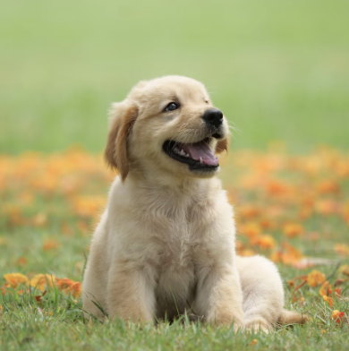
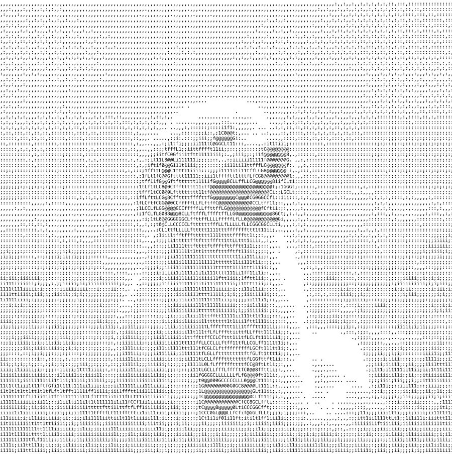
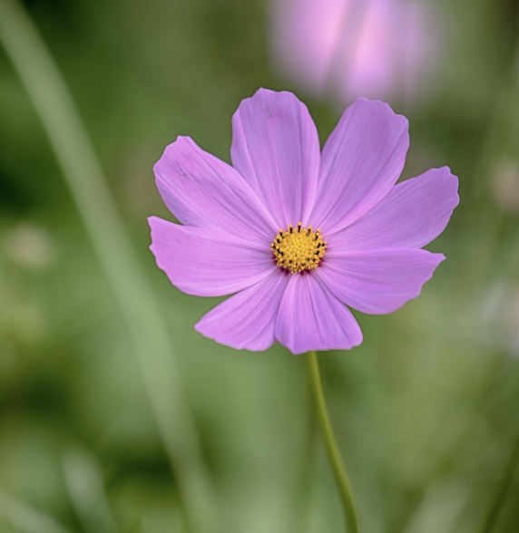
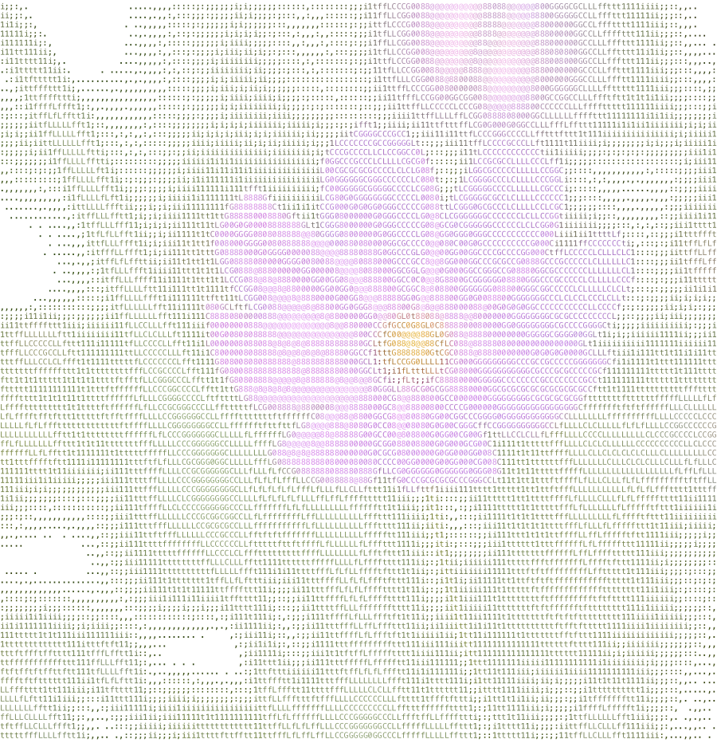
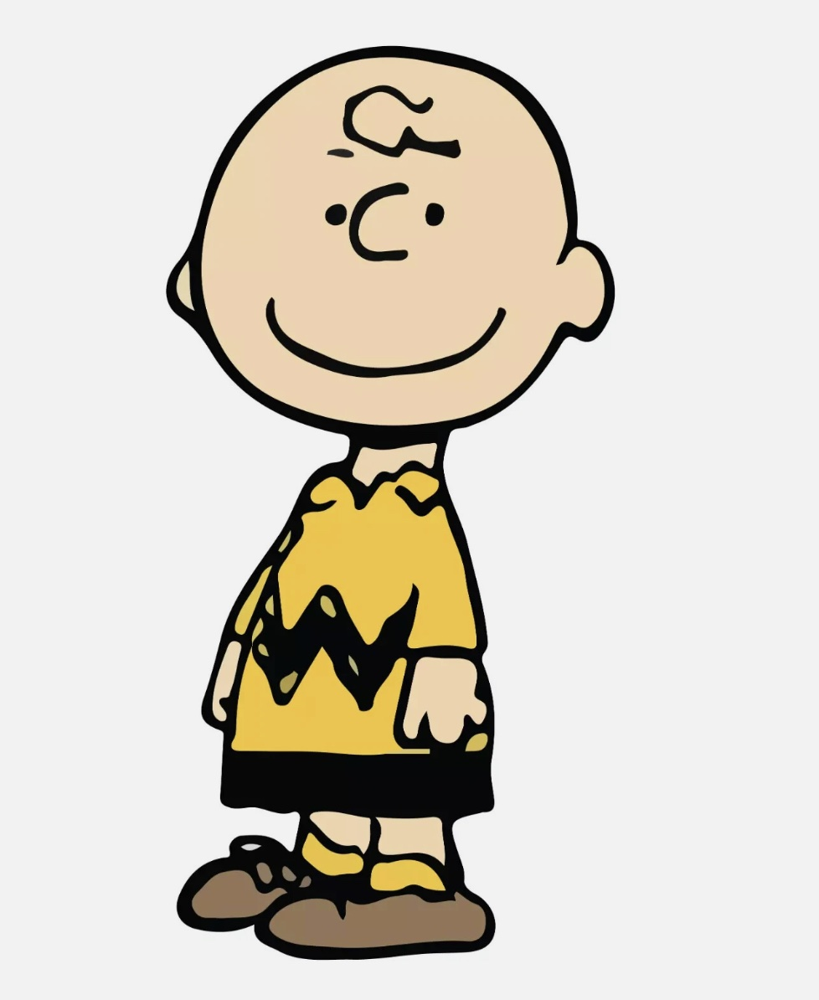
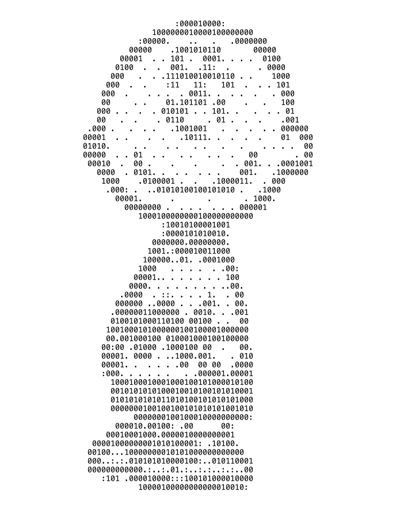

# Terminal Artist

Render images and GIFs as ASCII art in Rust — plus Unicode half-blocks, Braille
dot-matrix, and emoji, with optional ANSI 256 / truecolor.

A Rust library (`terminal_artist`) and CLI (`tartist`).

Curious how it works? See [the algorithm](doc/algorithm.md) — downscaling
(and why cartoons need a different one), auto-contrast, Floyd–Steinberg
dithering, Braille bit-packing, and color mapping.

## Gallery

<table>
<tr><th>Original</th><th>Terminal art</th></tr>
<tr>
<td></td>
<td></td>
</tr>
<tr>
<td></td>
<td></td>
</tr>
<tr>
<td></td>
<td></td>
</tr>
</table>

```bash
tartist demo/dog.png     -w 160 -g density --invert --gamma 0.55 -o dog.svg
tartist demo/flower.jpg  -w 150 -g density -c truecolor -o flower.svg
tartist demo/charlie.jpg -w 90  -g " .:10" --invert --gamma 0.6 -o charlie.svg
```

Floyd–Steinberg dithering (on by default) turns smooth gradients into halftone
texture instead of flat character bands, auto-contrast stretches the brightness
range so a light subject still separates from the background, `--gamma` tunes
midtone density, and `-c truecolor` keeps color (the pink petals vs. green
leaves) so the flower reads even where grayscale can't tell them apart.

## Install

```bash
cargo install --path .        # CLI: tartist
```

Or add the library:

```toml
[dependencies]
terminal_artist = { git = "https://github.com/wuisabel-gif/terminal_artist" }
```

## CLI

```
tartist <IMAGE> [OPTIONS]
```

```bash
tartist cat.png                          # ascii, 80 cols, to terminal
tartist cat.png -w 120 -c truecolor      # colored
tartist cat.png -r half -c truecolor     # half-blocks (2× vertical res)
tartist cat.png -r braille -c truecolor  # braille dot-matrix
tartist cat.png -g moon                  # emoji brightness ramp
tartist cat.png -g "@#*+=-. "            # custom glyph ramp (dark→light)
tartist cat.png -o out.txt               # export as text
tartist cat.png -o out.svg               # export as a scalable image (never wraps)
tartist loop.gif                         # play the animation (Ctrl-C to stop)
tartist loop.gif --once                  # just the first frame
```

| Option | Meaning | Default |
|---|---|---|
| `<IMAGE>` | input image or GIF (PNG, JPEG, GIF, WebP, BMP, …) | required |
| `-o, --output` | write to a file: `.svg` → scalable image, anything else → plain text | stdout |
| `-w, --width` | output width in cells | `80` |
| `-r, --renderer` | `ascii` \| `half` \| `braille` | `ascii` |
| `-c, --color` | `none` \| `ansi256` \| `truecolor` | `none` |
| `-g, --glyphs` | preset (`standard`, `blocks`, `simple`, `binary`, `shaded`, `density`, `portrait`, `dots`, `detailed`, `moon`) or a custom dark→light string | `standard` |
| `-a, --char-aspect` | font cell height/width ratio | `0.5` terminal, `0.525` SVG export, `1.0` `moon` |
| `-t, --threshold` | Braille dot on/off luminance cutoff (only with `--no-dither`) | `128` |
| `--invert` | flip brightness→glyph mapping | off |
| `--no-contrast` | disable the auto brightness stretch | off (stretch on) |
| `--no-dither` | disable Floyd–Steinberg dithering (crisp bands, good for line art) | off (dither on) |
| `--gamma` | midtone gamma: `<1` brightens (sparser art), `>1` darkens | `1.0` |
| `--lineart` / `--no-lineart` | force darkest-pixel downscaling on/off (keeps thin strokes solid) | auto-detected |
| `--once` | render only a GIF's first frame | off |
| `-l, --loops` | animation loops, `0` = forever | `0` |

## Library

```rust
use terminal_artist::{render, Options, Renderer, ColorMode};

let img = image::open("cat.png")?;
let art = render(&img, &Options {
    width: 100,
    renderer: Renderer::Braille,
    color: ColorMode::TrueColor,
    ..Default::default()
});
print!("{art}");
```

GIF frames are ordinary `DynamicImage`s — decode them however you like and call
`render` per frame.

## Notes

- `-o out.svg` exports a scalable, monospaced image that never line-wraps and
  opens in any browser — the reliable way to share art (raw text wraps). Any
  other extension writes plain text.
- Half-blocks are always colored; `-c none` coerces to truecolor.
- Video (mp4/webm) is out of scope — it needs an external ffmpeg dependency.

## License

MIT
